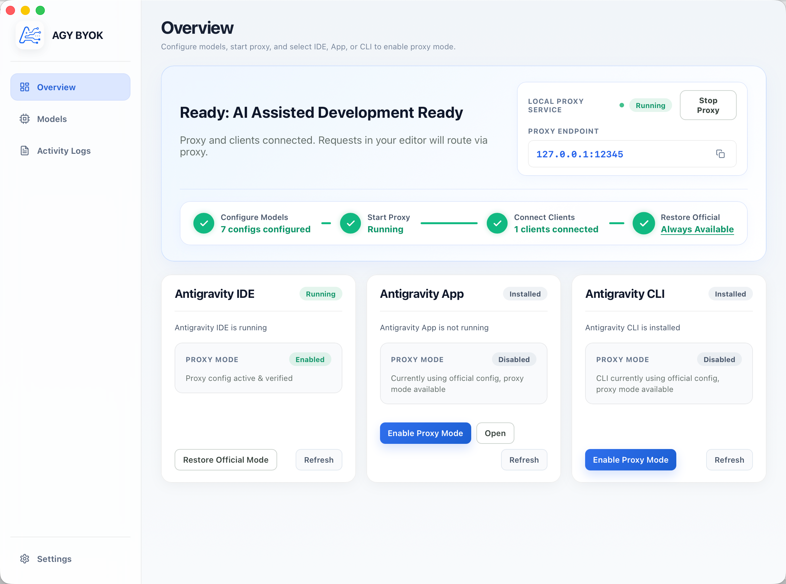
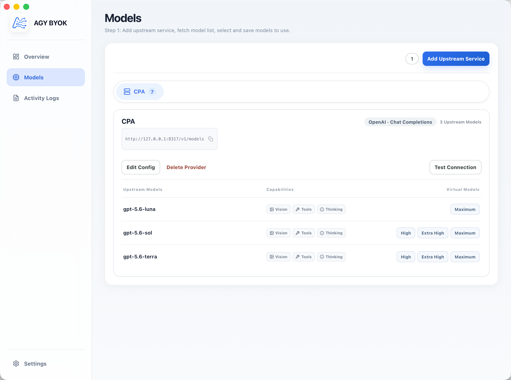
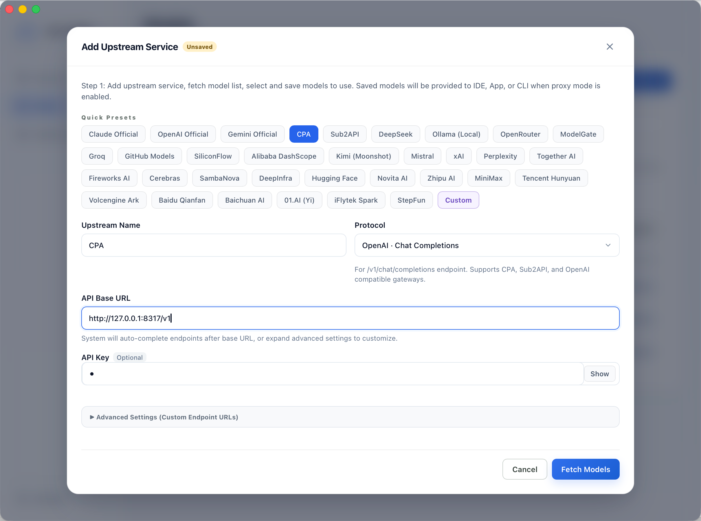
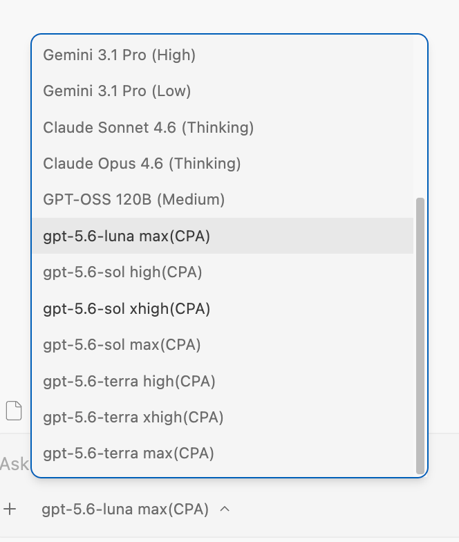
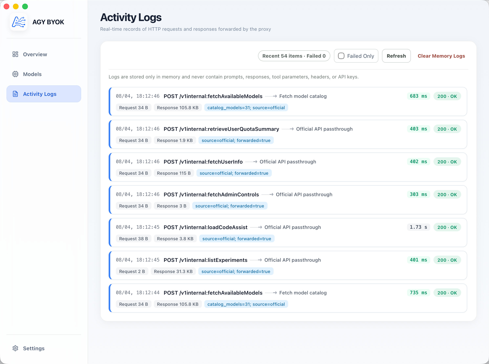
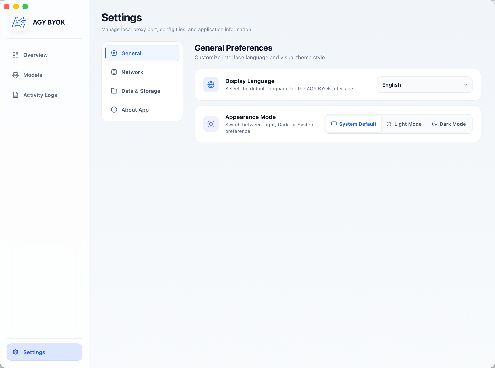

# AGY BYOK

[简体中文](README.md) · English

[](LICENSE)
[](#project-status)
[](#requirements)

A **local BYOK model integration tool for the Antigravity family of AI tools**, enabling **Antigravity IDE**, **Antigravity App**, and **Antigravity CLI** to connect to other model services through a local proxy.

### Why was this built?

Antigravity currently only provides models from the Gemini family and older Claude models. Gemini’s capabilities are still relatively limited, the Pro-series models have not arrived for a long time, and official BYOK support is not available. This creates friction for people who like or are used to the Antigravity family of AI tools.

This project is intended to solve that problem. If you have subscriptions to other AI services or access to another model gateway, AGY BYOK can inject your models into Antigravity IDE, App, or CLI for use.

---

## Community

### Telegram Group

[Join the Telegram group](https://t.me/+IMj6SaNJAAhlNjM1)

---

## Feature overview

### 1. Run Overview

Run Overview is the main AGY BYOK console and provides a single place to inspect proxy and host status:

- **Proxy status**: See whether the local proxy is running and view its actual listening address
- **Configuration status**: See the number of configured models and the current readiness state
- **Host status**: Detect whether Antigravity IDE, App, and CLI are installed or running
- **Quick actions**: Start or stop the proxy and enable proxy mode for a selected host
- **Safe restoration**: Restore official mode independently for each host

> 

### 2. Provider and Model Management

- **Provider presets**: Use common Provider presets or configure a custom upstream service
- **Model list**: Fetch models from an upstream service according to its protocol and select the models to provide to Antigravity
- **Capability configuration**: Configure image input, tool calls, and Thinking / Reasoning capabilities for each model
- **Connection tests**: Test an entire Provider, an individual model, or a group of models

> 

#### 2.1 Add an Upstream Service

When adding an upstream service, you can choose an existing Provider preset or configure a custom service manually:

- Supports OpenAI, Anthropic, Gemini, and OpenAI-compatible services;
- API keys are optional for local model services without authentication;
- Enter the service root URL as the API address; the system completes the model-list and generation paths according to the selected protocol;
- Advanced settings support custom endpoint URLs;
- After fetching the model list, save only the models that should be exposed to the host.

> 

#### 2.2 Inject Models into Antigravity

After saving models and enabling proxy mode for a host, the models appear in Antigravity’s model selector. The host can still use official models, while custom models are routed by AGY BYOK to the configured Provider.

> 

### 3. Local Proxy and Host Integration

AGY BYOK uses a local proxy that listens only on the local machine to perform protocol conversion and request forwarding:

- The default address is `http://127.0.0.1:12345`;
- If the desktop proxy port is occupied, an available Loopback port is selected automatically;
- The proxy can be integrated independently with Antigravity IDE, App, and CLI;
- Official native models continue to use official Cloud Code;
- Models generated by AGY BYOK are routed through the local proxy and the corresponding Provider Adapter.

Host integration works as follows:

| Entry point | Integration | Effect |
| :--- | :--- | :--- |
| Antigravity IDE | Updates `jetski.cloudCodeUrl` in the user `settings.json` | May restart the running host when switching |
| Antigravity App | Manages a `language_server` wrapper pointing to the local proxy | May restart the running host when switching |
| Antigravity CLI | Writes the `CLOUD_CODE_URL` Shell environment variable | Takes effect in a new or reloaded Shell |

### 4. Upstream Protocols and Model Capabilities

The following upstream protocols are currently supported:

| Protocol | Common endpoint | Typical use |
| :--- | :--- | :--- |
| OpenAI Chat Completions | `/v1/chat/completions` | OpenAI-compatible gateways |
| OpenAI Responses | `/v1/responses` | Responses API-compatible services |
| Anthropic Messages | `/v1/messages` | Anthropic official or compatible services |
| Gemini `generateContent` | `/v1beta/models/{model}:generateContent` | Native Gemini API |

Supported request capabilities include:

- Text input;
- Inline images;
- Tool calls;
- Streaming responses;
- Thinking / Reasoning level mapping for different Providers.

The exact capabilities depend on the upstream service. The Model Management page records the confirmed capabilities and maps them during protocol conversion.

### 5. Activity Logs

Activity Logs show the metadata of HTTP requests and responses forwarded by the proxy:

- View request routing, Provider, status, and duration;
- Distinguish official API passthrough from custom-model routing;
- Refresh the list, filter failed requests, and clear in-memory logs;
- Logs are kept only in memory and do not contain prompts, responses, tool arguments, headers, or API keys.

> 

### 6. Application Settings

Application Settings manages the local proxy port, configuration files, and application preferences:

- **General preferences**: Change the interface language and appearance theme;
- **Network proxy**: View and adjust local proxy settings;
- **Data & Storage**: Manage local configuration and data locations;
- **About App**: View application information.

> 

---

## How it works

```text
Antigravity IDE / App / CLI
            │
            │ Select a Model injected by AGY BYOK
            ▼
      http://127.0.0.1:12345
            │
            │ Protocol conversion, model routing, request forwarding
            ▼
 Provider / internal gateway / local model service
```

---

## Installation

The project currently supports macOS and Windows. The examples below use macOS as the primary example; Windows uses the same Tauri / npm commands for building.

### 1. Download and install the prebuilt package for your platform

#### First launch of an unsigned macOS App

After installing the App for the first time, run the following command before opening it:

```bash
sudo xattr -rd com.apple.quarantine "/Applications/AGY BYOK.app"
```

### 2. Run from source

#### Requirements

- macOS or Windows;
- Rust stable and Cargo;
- Node.js and npm;
- Xcode Command Line Tools on macOS, and the Windows build tools required by Tauri on Windows.

#### Install dependencies and start

From the project root:

```bash
npm install
npm run tauri dev
```

After launch, open **Model Management** and add a Provider and models to begin configuring the tool. Source development does not require the quarantine command above.

---

## Troubleshooting

### macOS says that the App cannot be opened

Run the following command in a system terminal and then open the App again:

```bash
sudo xattr -rd com.apple.quarantine "/Applications/AGY BYOK.app"
```

### Windows says that the publisher is unknown

First verify that the installer came from a trusted build or release source. Windows SmartScreen warnings are commonly related to an application that has not completed signing; do not bypass system protection for an application from an unknown source.

### The IDE or App does not use custom models after the proxy starts

Check the following items in order:

1. Confirm that at least one model has been saved in **Model Management**;
2. Confirm that the local proxy is running in **Run Overview**, and note its actual listening address;
3. Confirm that proxy mode is enabled on the corresponding host card;
4. If the IDE or App is running, wait for the required restart or reopen it manually;
5. The CLI requires a new terminal;
6. Check **Activity Logs** to confirm that the request reached the local proxy.

### Provider connection tests fail

Check that the API address is the correct service root URL, the protocol matches the upstream service, the API key is valid, and the upstream service does not require an additional endpoint configuration. API keys can be left empty for local services without authentication.

### Does restoring official mode delete my configuration?

No. Restoring official mode only reverts the host configuration managed by AGY BYOK. It does not delete Providers, models, or local configuration, and it does not stop the local proxy automatically.

---

## Unofficial notice

AGY BYOK is an independently developed, unofficial compatibility tool. It is not affiliated with, authorized by, or endorsed by Google or Antigravity. The project does not distribute Antigravity’s original binaries or complete source code.

## License

This project is licensed under the [MIT License](LICENSE).

## Disclaimer

This project is intended only for personal learning and research. By using this project, you agree to:

- Comply with the terms of service and applicable laws of the relevant services;
- Assume responsibility for the risks of configuring and using custom Providers, API keys, and the local proxy.

The project author is not responsible for any direct or indirect losses resulting from the use of this project.
