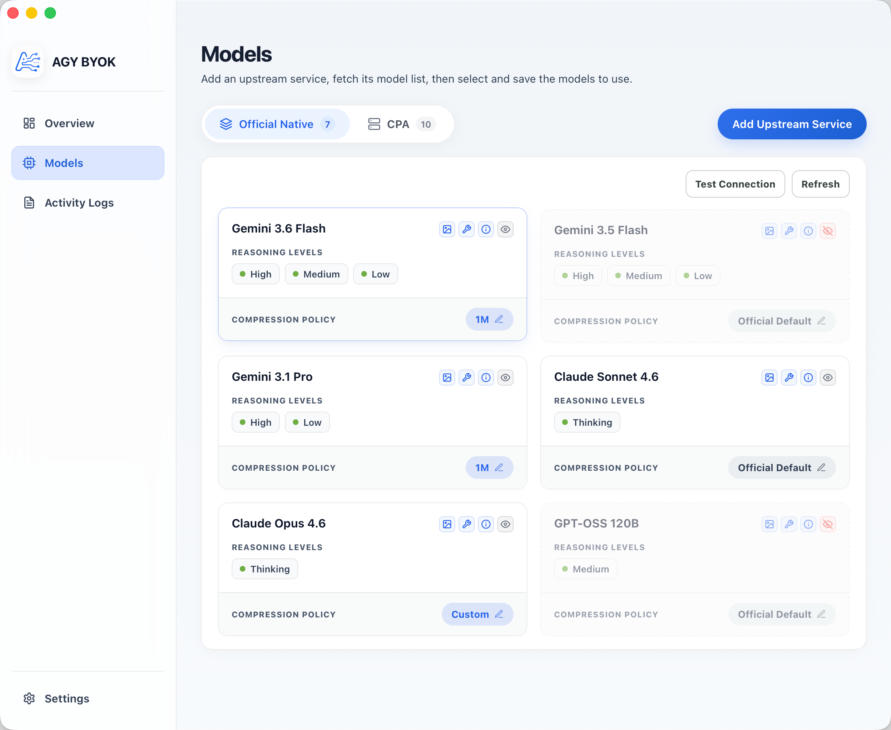
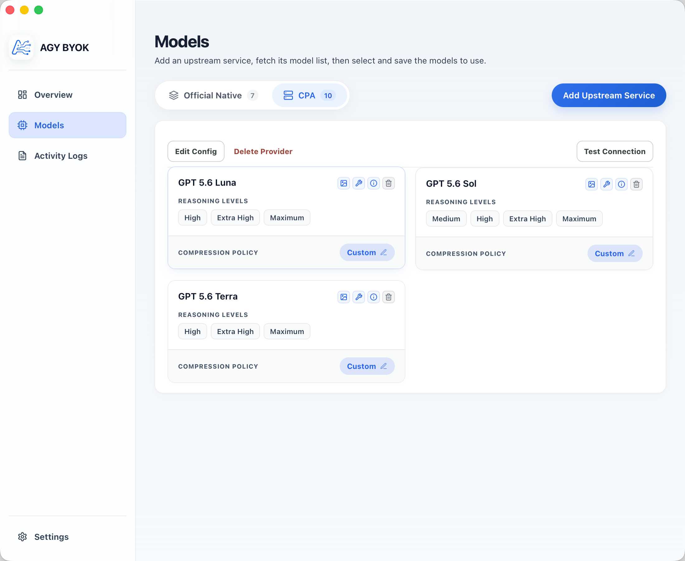
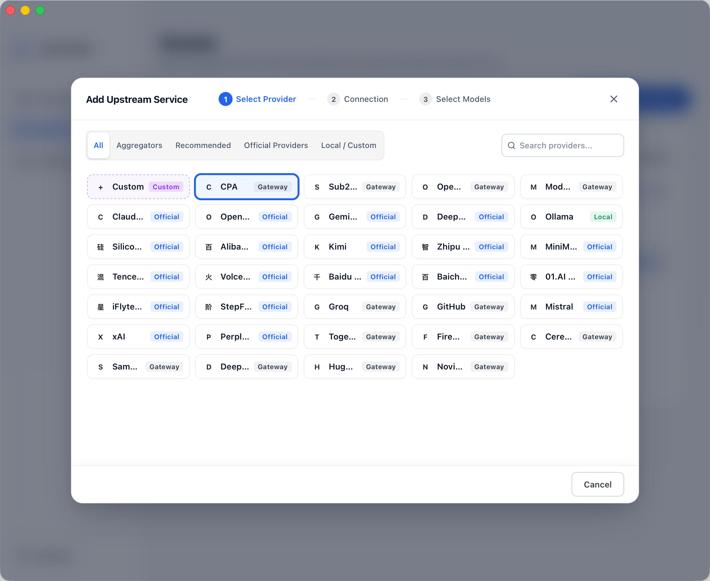
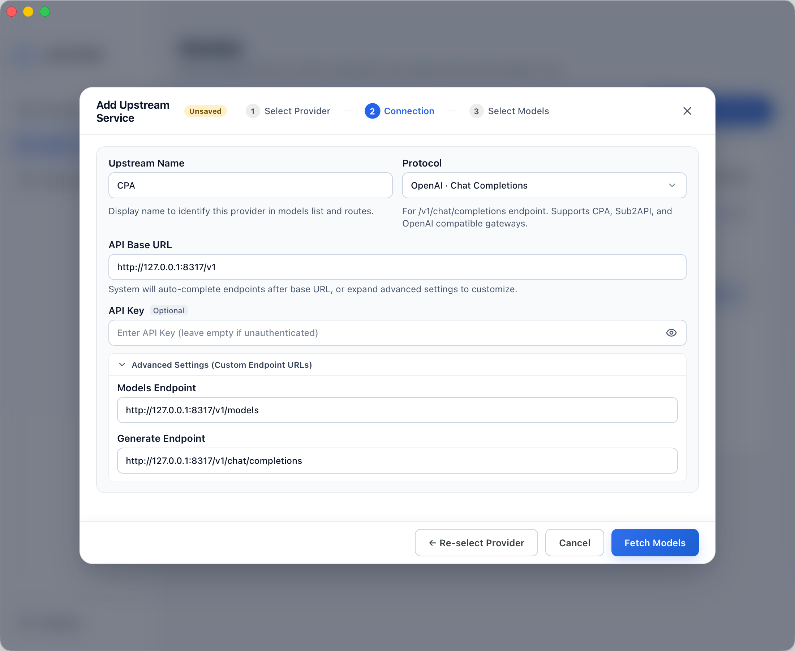
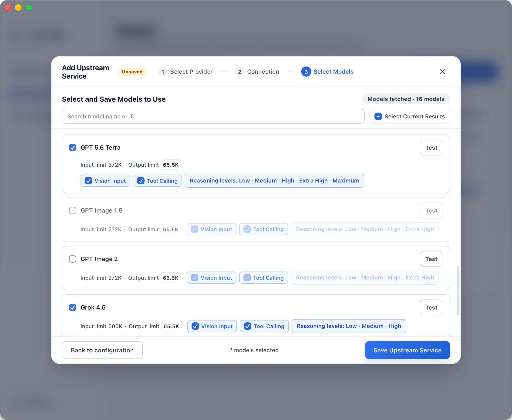
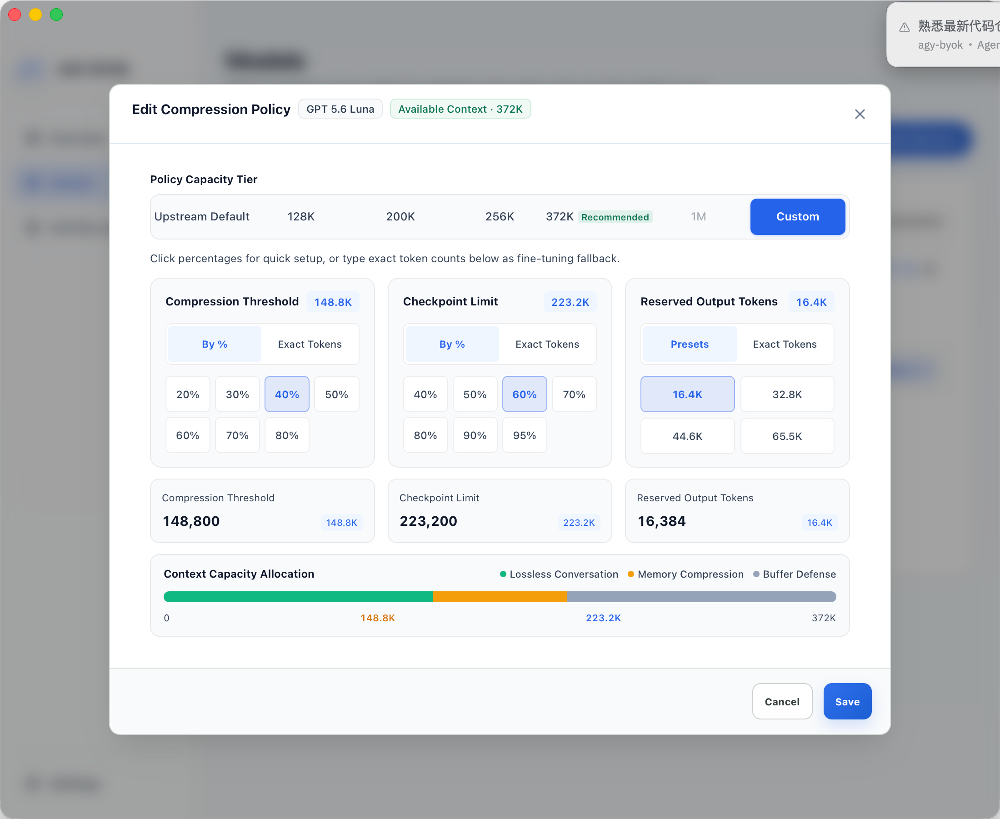

# AGY BYOK

[简体中文](README.md) · English

[](LICENSE)
[](#project-status)
[](#requirements)

A **local BYOK model integration tool for the Antigravity family of AI tools**, enabling **Antigravity IDE**, **Antigravity App**, and **Antigravity CLI** to connect to other model services through a local proxy.

### Why was this built?

Antigravity currently only provides models from the Gemini family and older Claude models. Gemini’s capabilities are still relatively limited, the Pro-series models have not arrived for a long time, and official BYOK support is not available. This creates friction for people who like or are used to the Antigravity family of AI tools.

This project is intended to solve that problem. If you have subscriptions to other AI services or access to another model gateway, AGY BYOK can inject your models into Antigravity IDE, App, or CLI for use.

## ⭐ Recommended companion: Antigravity IDE Cockpit

If you use Antigravity IDE regularly, install the [**Antigravity IDE Cockpit extension**](https://open-vsx.org/extension/yuzhiqiang/antigravity-ide-cockpit) alongside AGY BYOK. It is a dedicated account cockpit for Antigravity that brings multi-account, quota, usage, and session management into one sidebar panel:

- **Centralized multi-account management**: View all accounts, the active account, quota status, and token usage in one place;
- **Hot account switching**: Switch accounts without restarting whenever the environment supports it, minimizing interruptions;
- **Automatic intelligent switching**: Select a more suitable account based on Claude, Gemini, or the currently selected model’s quota status;
- **Quota and usage monitoring**: Track AI quota, token consumption, estimated cost, and model usage trends in real time;
- **Session and model diagnostics**: Manage sessions, check model availability, and export sanitized diagnostic reports.

In short: **AGY BYOK connects the models you want to use to Antigravity, while Antigravity IDE Cockpit keeps your accounts, quotas, and sessions under control.** Together, they make everyday Antigravity work smoother and more predictable.

👉 [Install Antigravity IDE Cockpit on Open VSX](https://open-vsx.org/extension/yuzhiqiang/antigravity-ide-cockpit) · [Visit agycockpit.com](https://agycockpit.com)

---

## Community

### Telegram Group

[Join the Telegram group](https://t.me/+IMj6SaNJAAhlNjM1)

---

## Feature overview

### 1. Run Overview

Run Overview is the main AGY BYOK console and provides a single place to inspect proxy and host status:

- **Proxy status**: See whether the local proxy is running and view its actual listening address
- **Configuration status**: See the number of configured models and the current readiness state
- **Host status**: Detect whether Antigravity IDE, App, and CLI are installed or running
- **Quick actions**: Start or stop the proxy and enable proxy mode for a selected host
- **Safe restoration**: Restore official mode independently for each host

> 

### 2. Provider and Model Management

- **Provider presets**: Huge list of built-in presets covering global official providers (OpenAI, Anthropic, Gemini, xAI, DeepSeek, etc.), popular aggregators, and local LLMs (Ollama).
- **Model list**: Fetch models from an upstream service according to its protocol and select the models to provide to Antigravity.
- **Manage Official Models**: Selectively disable or hide built-in official models to declutter your IDE's model selector.
- **Capability configuration**: Configure image input, tool calls, and granular Thinking / Reasoning capabilities (map explicit effort levels to different Providers) for each model.
- **Connection tests**: Test an entire Provider, an individual model, or a group of models.

> **Official Native Models Management**
> 

> **Custom Provider Models Management**
> 

#### 2.1 Add an Upstream Service

Adding an upstream service is simple and takes just 3 steps, supporting both built-in Provider presets and custom services:

1. **Select Provider**: Choose from official providers, popular recommendations, aggregators, or local LLM presets, or configure a fully custom service.
   > 

2. **Connection Config**: Enter API Base URL and Key supporting OpenAI, Anthropic, and Gemini protocols, with advanced endpoint URL customization.
   > 

3. **Select Models**: Fetch available models from upstream, configure vision, tool call, and reasoning capabilities, and selectively save models to expose to the host.
   > 

#### 2.2 Inject Models into Antigravity

After saving models and enabling proxy mode for a host, the models appear in Antigravity’s model selector. The host can still use official models, while custom models are routed by AGY BYOK to the configured Provider. You can also seamlessly toggle built-in official models off and on via the GUI to keep your workspace clean.

> 

#### 2.3 Per-model Context Compression
 
Antigravity’s official default compression policy is notably **conservative** (often triggering compression early in a session even when context usage is low). This causes frequent Checkpointer summaries during extended conversations, which adds extra latency, consumes redundant tokens, and risks over-summarizing early code context and chat history.

With AGY BYOK, you can customize the context compression strategy for each individual official or custom model to reduce compression frequency:

- **Presets & Fine-tuning**: Choose from presets ranging from **Deep Compression** to **Maximum Fidelity** (e.g., 128K, 200K, 256K, 372K, 1M), or manually set the **Compression Threshold**, **Checkpoint Limit**, and **Reserved Output Tokens** using quick percentages or exact token counts;
- **Compression Worker Model**: Let the compression worker follow the active model or use a fixed, lightweight Gemini Flash model to balance context fidelity, speed, and cost;
- **Default Passthrough**: Select **Official Default** or **Upstream Default** to preserve original limits without injecting custom overrides;
- **Application**: Compression policies and injection configs take effect after restarting Antigravity IDE or App.

> [!TIP]
> **💡 Context Compression Configuration Tips & Trade-offs:**
>
> - **⚠️ Setting thresholds too low (Triggers too frequently)**:
>   - Triggers compression after just a few conversational turns or reading a couple of files;
>   - Each compression incurs an additional LLM summarization call, increasing waiting latency and consuming extra tokens;
>   - Conversation history is repeatedly compressed and summarized, risking the loss of crucial early requirements and implementation details.
> - **⚠️ Setting thresholds too high (Too close to model physical limits)**:
>   - High risk of exceeding the upstream model's maximum context window and failing with request errors (`Context Window Exceeded` / `400 Bad Request`). Real requests contain not only chat history, but also system prompts, tool definitions, intermediate thinking/reasoning tokens, and reserved output buffers;
>   - Carrying massive contexts in every request significantly increases Time-to-First-Token (TTFT) and API token billing.
> - **✅ Recommended Practice**:
>   - Select a matching preset tier based on your upstream model’s actual maximum context window, leaving a **20% ~ 30% safety buffer** for outputs and tools (e.g., triggering compression around 148K for a 200K-context model). This effectively minimizes unnecessary compressions while completely avoiding context overflow errors.

> 

### 3. Local Proxy and Host Integration

AGY BYOK uses a local proxy that listens only on the local machine to perform protocol conversion and request forwarding:

- The default address is `http://127.0.0.1:12345`;
- If the desktop proxy port is occupied, an available Loopback port is selected automatically;
- The proxy can be integrated independently with Antigravity IDE, App, and CLI;
- Official native models continue to use official Cloud Code;
- Models generated by AGY BYOK are routed through the local proxy and the corresponding Provider Adapter.

Host integration differs by platform:

| Platform and entry point | Integration | Effect |
| :--- | :--- | :--- |
| macOS / Windows · Antigravity IDE | Updates `jetski.cloudCodeUrl` in the user `settings.json` and records reversible ownership | May restart the running host when switching |
| macOS · Antigravity App | Manages the user-session `CLOUD_CODE_URL` without modifying the vendor-signed bundle | May restart the running host when switching; AGY BYOK restores enabled state on startup |
| Windows · Antigravity App | Manages the user-level `CLOUD_CODE_URL` environment variable | May restart the running host when switching |
| macOS · Antigravity CLI | Manages the user-session `CLOUD_CODE_URL` | Takes effect after fully quitting and reopening the terminal application; AGY BYOK restores enabled state on startup |
| Windows · Antigravity CLI | Manages the user-level `CLOUD_CODE_URL` environment variable | Takes effect after fully quitting and reopening the terminal application |

The App and CLI share one environment-variable ownership record on each platform. The original value is restored only after the last owner is disabled. macOS uses the current login-session environment, while Windows uses the user-level environment. Changing the shared environment from the CLI card does not stop, launch, or restart a running App.

### 4. Upstream Protocols and Model Capabilities

The following upstream protocols are currently supported:

| Protocol | Common endpoint | Typical use |
| :--- | :--- | :--- |
| OpenAI Chat Completions | `/v1/chat/completions` | OpenAI-compatible gateways |
| OpenAI Responses | `/v1/responses` | Responses API-compatible services |
| Anthropic Messages | `/v1/messages` | Anthropic official or compatible services |
| Gemini `generateContent` | `/v1beta/models/{model}:generateContent` | Native Gemini API |

Supported request capabilities include:

- Text input;
- Inline images;
- Tool calls;
- Streaming responses;
- Thinking / Reasoning level mapping for different Providers.

The exact capabilities depend on the upstream service. The Model Management page records the confirmed capabilities and maps them during protocol conversion.

### 5. Activity Logs

Activity Logs show the metadata of HTTP requests and responses forwarded by the proxy:

- View request routing, Provider, status, and duration;
- Distinguish official API passthrough from custom-model routing;
- Refresh the list, filter failed requests, and clear in-memory logs;
- Logs are kept only in memory and do not contain prompts, responses, tool arguments, headers, or API keys.

> 

### 6. Application Settings

Application Settings manages the local proxy port, configuration files, and application preferences:

- **General preferences**: Switch between Simplified Chinese / English and change the appearance theme;
- **Network proxy**: View and adjust local proxy settings;
- **Data & Storage**: Manage local configuration and data locations;
- **About App**: View application information.

> 

---

## How it works

```text
Antigravity IDE / App / CLI
            │
            │ Select a Model injected by AGY BYOK
            ▼
      http://127.0.0.1:12345
            │
            │ Protocol conversion, model routing, request forwarding
            ▼
 Provider / internal gateway / local model service
```

---

## Installation

The project targets macOS and Windows. CI runs Rust Clippy, tests, and a complete Tauri desktop build natively on both platforms. The examples below use macOS as the primary example; Windows uses the same Tauri / npm commands for building.

### 1. Download the package for your platform

Go to [GitHub Releases](https://github.com/yuzhiqiang1993/agy-byok/releases/latest) to download the latest stable version:

| Platform | Recommended package |
| :--- | :--- |
| macOS Apple Silicon | `aarch64.dmg` |
| macOS Intel | `x64.dmg` |
| Windows | `x64-setup.exe` or `x64_en-US.msi` |

#### First launch of an unsigned macOS App

If macOS reports that the App cannot be opened after installation, run the following command and then open it again:

```bash
sudo xattr -rd com.apple.quarantine "/Applications/AGY BYOK.app"
```

### 2. Run from source

#### Requirements

- macOS or Windows;
- Rust stable and Cargo;
- Node.js and npm;
- Xcode Command Line Tools on macOS, and the Windows build tools required by Tauri on Windows.

#### Install dependencies and start

From the project root:

```bash
npm install
npm run tauri dev
```

After launch, open **Model Management** and add a Provider and models to begin configuring the tool. Source development does not require the quarantine command above.

---

## Troubleshooting

### macOS says that the App cannot be opened

Run the following command in a system terminal and then open the App again:

```bash
sudo xattr -rd com.apple.quarantine "/Applications/AGY BYOK.app"
```

### Windows says that the publisher is unknown

First verify that the installer came from a trusted build or release source. Windows SmartScreen warnings are commonly related to an application that has not completed signing; do not bypass system protection for an application from an unknown source.

### The IDE or App does not use custom models after the proxy starts

Check the following items in order:

1. Confirm that at least one model has been saved in **Model Management**;
2. Confirm that the local proxy is running in **Run Overview**, and note its actual listening address;
3. Confirm that proxy mode is enabled on the corresponding host card;
4. If the IDE or App is running, wait for the required restart or reopen it manually;
5. Fully quit and reopen the terminal application before using the CLI;
6. Check **Activity Logs** to confirm that the request reached the local proxy.

### Provider connection tests fail

Check that the API address is the correct service root URL, the protocol matches the upstream service, the API key is valid, and the upstream service does not require an additional endpoint configuration. API keys can be left empty for local services without authentication.

### Does restoring official mode delete my configuration?

No. Restoring official mode only reverts the host configuration managed by AGY BYOK. It does not delete Providers, models, or local configuration, and it does not stop the local proxy automatically.

---

## Unofficial notice

AGY BYOK is an independently developed, unofficial compatibility tool. It is not affiliated with, authorized by, or endorsed by Google or Antigravity. The project does not distribute Antigravity’s original binaries or complete source code.

## License

This project is licensed under the [MIT License](LICENSE).

## Disclaimer

This project is intended only for personal learning and research. By using this project, you agree to:

- Comply with the terms of service and applicable laws of the relevant services;
- Assume responsibility for the risks of configuring and using custom Providers, API keys, and the local proxy.

The project author is not responsible for any direct or indirect losses resulting from the use of this project.
