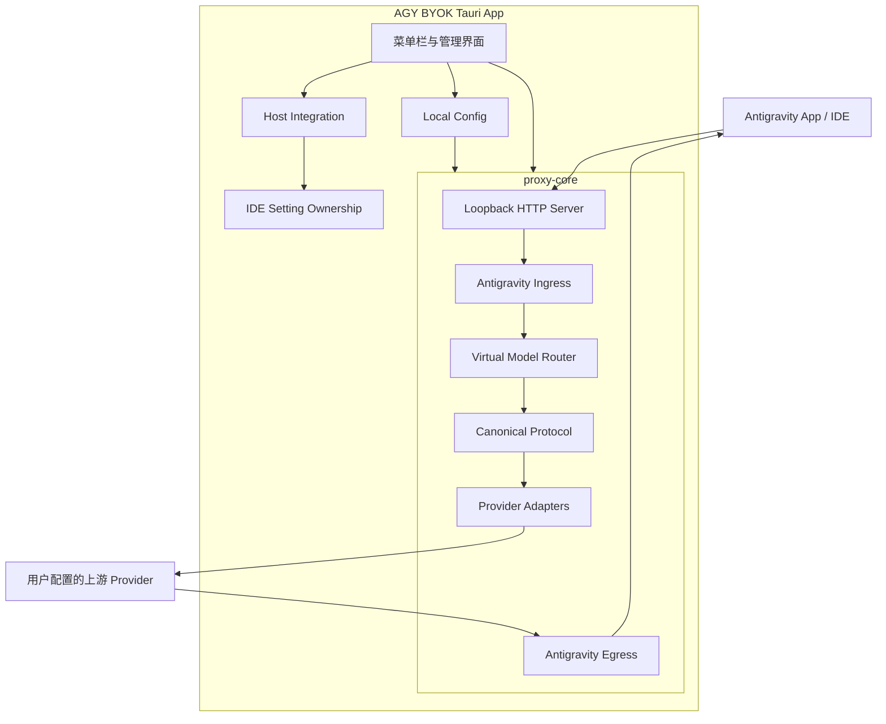

# AGY BYOK

[](LICENSE)
[](#当前状态)
[](#路线图)

> 面向 Antigravity App 和 Antigravity IDE 提供本地、可恢复的 Bring Your Own Key / Model 能力；当前可运行实现以 Antigravity IDE 为主。

> [!IMPORTANT]
> AGY BYOK 当前提供可运行的 macOS 桌面原型，可配置模型、启停代理，并通过 Antigravity IDE 原生 `jetski.cloudCodeUrl` 设置启用、启动或停用 IDE 接入。不会复制、修改或重签厂商 App Bundle。

## 项目目标

AGY BYOK 只解决四个核心问题：

1. 让 Antigravity App 和 Antigravity IDE 能发现并选择自定义模型。
2. 让自定义模型请求经过 AGY BYOK 自己的代理和协议转换代码。
3. 支持文本、图片、工具调用和模型思考等级。
4. 在不复制、不修改厂商 App Bundle 的前提下，通过宿主原生配置接入，并只恢复接管前的 `jetski.cloudCodeUrl` 值。

项目采用独立桌面 App 和本地代理，不把 Provider 管理、配置存储、自动更新等业务逻辑注入宿主应用。Antigravity IDE `2.1.1` 的 Extension 与 Electron Main 都原生读取 `jetski.cloudCodeUrl`；AGY BYOK 只管理这一项用户设置，即可让两条 Cloud Code 路径统一进入本地代理。

## 目标能力

- **多 Provider**：支持 OpenAI-compatible、Anthropic Messages 和 Google Gemini 三种线协议。
- **虚拟模型**：将 Provider、真实上游模型和宿主虚拟模型分层管理，使用稳定模型 ID。
- **思考等级**：同一上游模型可配置 `Low`、`Medium`、`High`、`XHigh`、`Max` 等虚拟变体，并由 Adapter 映射为 Provider 原生参数。
- **中立协议**：先将 Antigravity/Gemini 请求转换为 Canonical Protocol，再适配目标 Provider。
- **多模态与工具**：保留文本、图片顺序、Function Calling、流式 Tool Call 和公开的 Thinking Summary。
- **本地直接配置**：Provider 地址、API Key 和自定义 Header 统一保存在本地配置中，空 API Key 可连接无鉴权上游。
- **透明路由**：原生模型继续转发到官方 Cloud Code，自定义 VirtualModel 才进入 Provider Adapter；默认不跨模型切换，只有显式配置 fallback 时才尝试一次安全降级。
- **安全宿主边界**：厂商 App Bundle 始终只读；IDE settings 只管理 `jetski.cloudCodeUrl`，其他配置变化不参与接入状态判断。

## 当前状态

当前代码已经建立 `proxy-core`、`host-integration` 和最小 Tauri 2 桌面控制面。桌面 App 可以管理本地配置、显式启停代理、检测 IDE、启用或停用原生 `jetski.cloudCodeUrl` 接入，并启动厂商原版 IDE；IDE 运行中切换接入时会自动退出、更新 settings 并重新启动。生产代码不提供修改厂商原版 Bundle 的 Apply API。

| 范围 | 当前状态 |
| :--- | :--- |
| Cargo Workspace 与架构契约 | 已建立 |
| Provider、UpstreamModel、VirtualModel | 已建立，支持启停、参数覆盖、Reasoning Capability 和单级 fallback 配置 |
| 配置持久化与启动校验 | 已实现；配置写入 `config.v1.json`，Provider API Key 当前仍为本地明文存储 |
| Antigravity 请求/响应转换 | 已实现文本、内联图片、工具调用、Thinking、非流响应和 SSE 事件转换 |
| 模型目录注入 | 已实现对象型 `models` 与 `agentModelSorts` 成对注入；数组型目录只追加 `models` |
| OpenAI、Anthropic、Gemini Adapter | 非流式与每请求 Stream Decoder 已实现 |
| 原生请求转发 | 原生模型和其他 `/v1internal:*`、`/v1internal/*` 路由转发到官方 Cloud Code |
| Loopback HTTP 与 SSE | 已实现 Health Probe、请求体限制、并发限制、Graceful Shutdown 和自定义模型流式转发 |
| CLI 入口 | `cargo run -p agy-byok` 固定绑定 `127.0.0.1:51234`；端口占用时启动失败 |
| Tauri 2 桌面控制面 | 已实现最小窗口、模型配置、代理显式启停、状态查询、IDE 检测与原生配置接入 |
| 桌面动态端口 | 优先使用配置端口，默认 `51234`；占用时选择随机空闲回环端口并持久化实际端口 |
| IDE settings ownership | 只管理 `jetski.cloudCodeUrl`，记录接管前的目标键值，不恢复整个 settings 文件 |
| 自动测试 | 已覆盖配置、Adapter、SSE、HTTP、模型目录注入、settings 最小编辑和 ownership 语义 |
| Antigravity IDE 接入 | 原厂 IDE + `jetski.cloudCodeUrl` 已真实显示 6 个自定义模型，厂商 App 保持 Google 公证状态 |
| Antigravity App 接入 | 尚未进入当前实现 |

当前代理生命周期是最小实现，不是完整 Supervisor：桌面进程只在内存中保存一个 `HttpServerHandle`，通过 `start_proxy`、`stop_proxy` 和 `proxy_status` 显式管理。当前没有自动启动、崩溃拉起、后台守护、持续健康监控、期望状态持久化或异常退出后的自动恢复。

CLI 与桌面端口策略不同：CLI 当前固定使用 `51234`，不会读取 `AppConfig.proxy_port` 作为监听端口，也不会自动回退；桌面端读取并管理 `proxy_port`，端口冲突时回退到系统分配的空闲端口，再把实际端口写回配置。当前 IDE 接入和代理边界见 [IDE 接入与代理安全复盘](docs/IDE_PATCH_SAFETY.md)。

当前仍未完成或需要继续收口的能力包括：

- 宿主 Tool Result 与 OpenAI/Anthropic Tool Call ID 的真实多轮关联 Fixture。
- 配置层 `extra_body` 受控字段校验，以及 fallback 对单次请求参数的完整继承。
- Provider disabled、目录条目和实际可路由状态的一致性校验。
- 流式 usage 到活动日志的贯通，以及响应体统一大小限制。
- Host 路由认证与浏览器跨 Origin 访问策略收紧。
- API Key 的系统钥匙串或独立 Secret Store。
- Antigravity App 接入、完整桌面设置、发布签名、Notarization 和自动更新。

## 当前架构



核心约束：

- `proxy-core` 不依赖 Tauri，不操作宿主安装目录。
- Host Integration 不读取 Provider API Key，也不参与协议转换。
- UI 通过桌面 Command 管理配置、代理生命周期和 IDE settings 事务，不向宿主注入这些能力。
- 原生模型透明转发，自定义 VirtualModel 才进入 BYOK 协议转换。

## Workspace 结构

```text
agy-byok/
├── Cargo.toml                 # Cargo Workspace
├── Cargo.lock                 # 可复现依赖锁文件
├── crates/
│   ├── proxy-core/            # 代理领域、路由与 Provider Adapter
│   └── host-integration/       # 宿主发现、只读兼容性校验与 IDE 目标键 ownership
├── src-tauri/                  # Tauri Commands、代理生命周期与打包配置
├── src/                        # 原生 TypeScript 桌面界面
├── package.json
├── package-lock.json
├── docs/
│   ├── ARCHITECTURE.md        # 系统架构、风险边界与实施路线
│   ├── ANTIGRAVITY_IDE_INTEGRATION.md # IDE 原生配置链路与验收契约
│   └── IDE_PATCH_SAFETY.md    # macOS 历史补丁与当前只读边界
├── LICENSE
└── README.md
```

## 本地开发

### 环境要求

当前桌面 App 开发需要：

- macOS
- Rust stable 与 Cargo
- Node.js 与 npm
- Xcode Command Line Tools

### 获取代码

```bash
git clone https://github.com/yuzhiqiang1993/agy-byok.git
cd agy-byok
```

### 启动桌面 App

```bash
npm install
npm run tauri dev
```

构建调试版 macOS App：

```bash
npm run tauri build -- --debug
open "target/debug/bundle/macos/AGY BYOK.app"
```

### 验证基线

```bash
npm run build
cargo fmt --all -- --check
cargo clippy --workspace --all-targets --locked -- -D warnings
cargo test --workspace --locked
```

### 当前限制

`cargo run -p agy-byok` 会加载并校验配置，固定绑定 `127.0.0.1:51234`，然后执行内部 Health Probe。CLI 不使用配置中的 `proxy_port` 决定监听端口，端口占用时也不会自动选择其他端口。首次启动会创建：

```text
~/Library/Application Support/AGY BYOK/config.v1.json
```

开发环境可通过 `AGY_BYOK_CONFIG_PATH` 覆盖配置文件位置。桌面端优先使用配置中的端口；默认值为 `51234`，端口占用时回退到随机空闲回环端口，并持久化实际端口供 IDE settings 使用。

HTTP Server 只绑定 IPv4 Loopback，并拒绝非 Loopback peer，但这不等于只有 AGY BYOK 桌面进程可以访问：

- `/health`、`/healthz` 公开。
- `/v1/models`、`/v1beta/models` 默认要求进程内随机 Token。
- IDE 使用的 `/v1internal:*` 宿主路由默认不要求 AGY BYOK Token，因为 Electron Main 和插件 Language Server 没有可用的 Token 注入通道。
- 当前所有已识别路由返回开放 CORS，预检允许任意 Origin、Header，以及 GET、POST、OPTIONS。

因此当前安全边界是 **LoopbackOnly + 本机调用方可信假设**，不是浏览器 Origin 隔离。其他本地进程，以及能够访问本机回环地址的浏览器页面，都可能调用未认证的宿主路由；在收紧 Host 认证或 CORS 前，不应把代理暴露到非回环地址，也不适合作为多用户共享服务。透明转发会剥离 `x-agy-byok-token`，但会保留厂商 `Authorization`；如果把本地 Token 放在 `Authorization` 中访问透明转发路由，该 Header 也会被转发，因此管理调用应使用专用的 `x-agy-byok-token`。

当前 IDE settings 接入采用目标键 ownership，而不是整文件 Receipt/快照恢复：

- 状态检查只判断 `jetski.cloudCodeUrl` 是否精确等于当前代理 Endpoint，不依赖 ownership 文件，也不受其他 settings 变化影响。
- 启用时只最小修改目标键，并记录接管前的值和尾逗号信息；如果代理 Endpoint 变化且旧 Endpoint 仍由 AGY BYOK 管理，会继续保留第一次启用前的值。
- 停用时只有目标键仍等于当前受管 Endpoint 才会处理：存在匹配 ownership 时恢复原值，否则删除目标键；如果用户或第三方已把目标键改成其他值，则视为 Disabled 且不覆盖该值。
- 旧版 `ide-settings-receipt.json` 和 `ide-settings-original.jsonc` 不参与当前状态判断。

V7 已证明不能原地修改厂商 Bundle，V8 已证明同 ID 用户扩展不能可靠覆盖内置扩展，V9/V10 的托管副本路线也已被否决。当前实现不创建 App 副本，不执行 codesign 或 quarantine 写入。历史 V11 真实探针使用的是 `127.0.0.1:50999`，它只代表当时的验证环境：探针已确认 Electron Main 与插件 LS 都进入代理，且 6 个自定义模型在下拉框可见；当前 CLI 和桌面默认端口均已调整为 `51234`。详细原理见 [IDE 接入与代理安全复盘](docs/IDE_PATCH_SAFETY.md)。

## 实现原则

### 请求链路透明

- 原生模型继续访问原 Cloud Code 服务，自定义模型才进入 Provider Adapter。
- 透明转发保留 method、path/query、body、厂商 Authorization 和大部分端到端 Header，但会过滤 hop-by-hop Header、Host、Content-Length 和 `x-agy-byok-token`，并强制 `Accept-Encoding: identity`。
- 生成路由需要先读取受大小限制的 UTF-8 JSON 并识别模型 ID，因此它不是字节级任意协议代理。
- 默认不自动切换 Provider 或模型；只有显式配置 fallback、主路由发生可重试错误且流式响应尚未输出 frame 时，才尝试一次备用 VirtualModel。

### 能力显式声明

- 图片、工具、并行工具和 Thinking 能力由 UpstreamModel 显式配置。
- 不通过模型名称正则猜测能力。
- 不支持的思考等级返回明确错误，不静默忽略。

### 流状态属于单次请求

- 每个请求创建独立 UTF-8、SSE 和 Provider Decoder。
- Tool Call ID、参数增量和 Thinking 状态不能按模型名全局共享。
- 客户端取消后立即中止上游请求。

### 厂商 Bundle 必须只读

- 不修改厂商 App Bundle 内的资源、可执行文件、签名或 quarantine。
- 版本、文件哈希和 Google 签名只用于只读兼容性判断；未匹配 Profile 时禁止启用 IDE 配置接入。
- 当前生产接入只修改用户 settings 中的 `jetski.cloudCodeUrl`，并拒绝 symlink、重复目标键和非法 JSONC。
- ownership 只负责目标键原值，不拥有整个 settings 文件；其他键的变化必须保留。
- 用户或第三方改写目标键后，停用操作不得覆盖其新值。

## 路线图

### M0：仓库与契约基线

- [x] 建立 Cargo Workspace
- [x] 建立架构与安全恢复契约
- [x] 建立格式、Clippy 和测试基线
- [x] 整理 IDE 2.1.1 模型发现与 Endpoint 兼容性事实

### M1：Canonical 与 Adapter 收口

- [x] 重构中立 Request、Response 和 Stream Event
- [x] 建立强类型 Reasoning Capability
- [ ] 完成宿主 Tool Result 与真实 Tool Call ID 的 Fixture 和关联验证
- [ ] 收紧 `extra_body` 和配置不变量
- [x] 完善三种 Adapter 非流式测试

### M2：HTTP 与 SSE

- [x] 实现 Loopback HTTP Server 和 Health Probe
- [x] 实现原生模型透明转发
- [x] 实现增量 UTF-8、SSE Frame 和 Provider Decoder
- [x] 实现客户端取消、请求/空闲超时、并发限制和 Graceful Shutdown

### M3：Tauri 控制面

- [x] 初始化 Tauri 2 最小桌面窗口
- [x] 接入 Provider/Model 添加、删除和本地配置
- [x] 实现基于单个 `HttpServerHandle` 的显式启停与状态查询
- [ ] 自动启动、持续健康监控、崩溃拉起和期望状态持久化
- [ ] 菜单栏、完整编辑与 Settings

### M4：macOS 宿主接入

- [x] Antigravity IDE 2.1.1 原生 `jetski.cloudCodeUrl` 接入与目标键 ownership
- [ ] Antigravity App 分层接入 Profile
- [x] 历史 Receipt v2 与完整 Snapshot Restore 测试
- [x] 真实 IDE Discovery 与只读候选校验
- [x] V7 Bundle Apply 运行探针（失败并恢复，生产 Apply 已移除）
- [x] V8 隔离用户扩展覆盖探针（重复 Language Server，路线终止）
- [x] V9/V10 托管副本路线取证与回滚
- [x] V11 原厂 IDE 双 Endpoint、6 模型真实可见性验证

### M5：发布与平台扩展

- [ ] macOS 签名、Notarization 和更新
- [ ] Windows 文件锁、UAC 和 ACL
- [ ] Linux 安装类型、polkit 和 xattr

## 安全与隐私

默认禁止日志记录：

- Prompt、模型回答和 System Prompt
- Tool 参数和结果
- 图片、文件内容和用户完整本地路径
- API Key、Authorization、Cookie 和原始 Header
- 未脱敏的 Provider 错误正文

应用只在内存中保留最近 200 条脱敏调用元数据，包括路由模型、Provider、协议、流式状态、消息/工具数量、耗时、HTTP 状态，以及从结构化 Provider 错误中提取并截断的诊断摘要；应用退出后自动清空，也可在界面手动清空。

远程 Provider 默认必须使用 HTTPS；只有显式配置的 Loopback Provider 可以使用 HTTP。Provider API Key 当前以明文写入本地配置，桌面 UI 的遮挡只影响显示，不等同于加密存储。

本地 HTTP Server 当前采用 LoopbackOnly，但宿主路由默认无 AGY BYOK Token 且开放 CORS。这个边界用于兼容当前 IDE，不应解释为浏览器 Origin 安全隔离；在 Host 认证或 CORS 策略收紧前，禁止改为非回环监听，也不应作为共享代理服务。

附件下载能力尚未实现；后续实现时需要限制大小、重定向和目标地址，并防止 SSRF 与跨 Origin 凭证泄漏。

如果发现安全问题，请不要在公开 Issue 中附带真实 API Key、Prompt、文件内容或安装备份。

## 非官方声明

AGY BYOK 是独立开发的非官方兼容工具，与 Google 或 Antigravity 官方没有隶属、授权或背书关系。Antigravity 和 Google 商标仅用于说明兼容目标。

项目不会分发 Antigravity 原始二进制或完整源码。未来 Patch Profile 只保存必要的版本、哈希、Anchor、转换规则和 AGY BYOK 自有内容。

## 许可证

本项目使用 [MIT License](LICENSE)。
