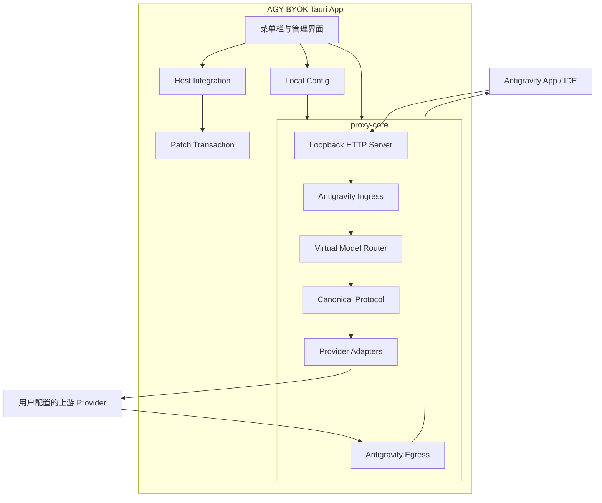

# AGY BYOK

[](LICENSE)
[](#当前状态)
[](#路线图)

> 为 Antigravity App 和 Antigravity IDE 提供本地、安全、可恢复的 Bring Your Own Key / Model 能力。

> [!IMPORTANT]
> AGY BYOK 当前处于代理核心原型阶段，还不能作为可用的 Antigravity 本地代理，也不会修改你已安装的 Antigravity 或 Antigravity IDE。仓库中的目标能力和架构方案不代表对应功能已经实现。

## 项目目标

AGY BYOK 只解决四个核心问题：

1. 让 Antigravity App 和 Antigravity IDE 能发现并选择自定义模型。
2. 让自定义模型请求经过 AGY BYOK 自己的代理和协议转换代码。
3. 支持文本、图片、工具调用和模型思考等级。
4. 安全地应用和恢复宿主补丁，恢复时不使用旧备份覆盖厂商新版本。

项目采用独立桌面 App 和本地代理，不把 Provider 管理、配置存储、自动更新等业务逻辑注入宿主应用。宿主补丁只负责将必要的 Cloud Code 流量导向 AGY BYOK。

## 目标能力

- **多 Provider**：支持 OpenAI-compatible、Anthropic Messages 和 Google Gemini 三种线协议。
- **虚拟模型**：将 Provider、真实上游模型和宿主虚拟模型分层管理，使用稳定模型 ID。
- **思考等级**：同一上游模型可配置 `Low`、`Medium`、`High`、`XHigh`、`Max` 等虚拟变体，并由 Adapter 映射为 Provider 原生参数。
- **中立协议**：先将 Antigravity/Gemini 请求转换为 Canonical Protocol，再适配目标 Provider。
- **多模态与工具**：保留文本、图片顺序、Function Calling、流式 Tool Call 和公开的 Thinking Summary。
- **本地直接配置**：Provider 地址、API Key 和自定义 Header 统一保存在本地配置中，空 API Key 可连接无鉴权上游。
- **透明路由**：用户选择哪个模型就请求哪个模型，不静默跨模型切换。
- **安全补丁**：根据精确版本、文件哈希和 Patch Profile 应用补丁，并通过事务快照和运行探针完成恢复。

## 当前状态

当前代码已经建立 `proxy-core` 和 `host-integration` 两个 Rust crate。代理具备 Canonical Protocol、三种 Provider Adapter、状态化 SSE、模型目录合并和原生 Cloud Code 透明转发；宿主集成具备只读发现、精确 Profile、候选生成、事务快照、Receipt、Apply/Restore 和失败回滚库。真实安装目录尚未应用新补丁。

| 范围 | 当前状态 |
| :--- | :--- |
| Cargo Workspace 与架构契约 | 已建立 |
| Provider、UpstreamModel、VirtualModel | 已建立 |
| Canonical Protocol 与 Reasoning Capability | 已建立 |
| Cloud Code 生成请求与响应 Envelope | 已实现 |
| IDE 2.1.1 模型发现 | 已验证 `fetchAvailableModels` JSON 会进入 `GetAvailableModels`；无需第二补丁 Anchor |
| OpenAI、Anthropic、Gemini Adapter | 非流式与每请求 Stream Decoder 已实现 |
| Mock 上游、协议、HTTP 与补丁事务 | 已有 58 个测试覆盖 |
| `127.0.0.1:50999` HTTP 监听与 Health Probe | 已实现 |
| SSE 端到端流式转发 | 自定义 VirtualModel HTTP 路径已实现 |
| 配置持久化与启动校验 | 已实现，管理 UI 尚未接入 |
| Tool Call/Thinking 状态机 | Provider 与 Egress 聚合已实现，宿主 Tool Result 关联待 Fixture |
| Tauri 2 菜单栏和管理界面 | 未实现 |
| Antigravity IDE 接入与恢复 | Rust 库和临时 `.app` Fixture 已实现；真实 Dry Run/Apply 尚未通过 |
| Antigravity App 接入 | 尚未进入新项目实现 |

当前二进制会绑定 `127.0.0.1:50999`，提供 Health、模型列表以及非流式和流式生成路由。详细的已知缺口、目标架构和验收边界见 [系统架构与实现方案](docs/ARCHITECTURE.md)。

## 计划架构



核心约束：

- `proxy-core` 不依赖 Tauri，不操作宿主安装目录。
- Host Integration 不读取 Provider API Key，也不参与协议转换。
- UI 通过桌面 Command 管理配置、代理生命周期和补丁命令，不向宿主注入这些能力。
- 原生模型透明转发，自定义 VirtualModel 才进入 BYOK 协议转换。

## Workspace 结构

```text
agy-byok/
├── Cargo.toml                 # Cargo Workspace
├── Cargo.lock                 # 可复现依赖锁文件
├── crates/
│   ├── proxy-core/            # 代理领域、路由与 Provider Adapter
│   └── host-integration/       # 宿主发现、精确 Profile、补丁事务与恢复
├── docs/
│   └── ARCHITECTURE.md        # 系统架构、风险边界与实施路线
├── LICENSE
└── README.md
```

计划新增但尚未初始化：

```text
src-tauri/                     # Tauri 控制面
src/                           # 菜单栏和管理界面
patch-profiles/                # 经过验证的宿主兼容 Profile
```

## 本地开发

### 环境要求

当前代理核心开发需要：

- macOS
- Rust stable
- Cargo
- Xcode Command Line Tools

后续初始化 Tauri 2 前端后，还会增加 Node.js 和前端包管理器要求。

### 获取代码

```bash
git clone https://github.com/yuzhiqiang1993/agy-byok.git
cd agy-byok
```

### 验证基线

```bash
cargo fmt --all -- --check
cargo clippy --workspace --all-targets --locked -- -D warnings
cargo test --workspace --locked
```

### 当前限制

`cargo run -p agy-byok` 会加载并校验配置，绑定 `127.0.0.1:50999`，然后执行内部 Health Probe。首次启动会创建：

```text
~/Library/Application Support/AGY BYOK/config.v1.json
```

开发环境可通过 `AGY_BYOK_CONFIG_PATH` 覆盖配置文件位置。管理模型列表路由仍要求进程内 Token；当前 IDE Profile 使用的模型发现和生成路由仅允许 Loopback，但不要求宿主携带随机 Token，因为运行探针确认 Language Server 没有可用的 Token 注入通道。这意味着同一用户权限下的其他本地进程也能访问这些宿主路由。

当前机器已重装 Antigravity IDE `2.1.1`，厂商原始 `extension.js` 哈希和 Google 签名均已恢复，尚未执行新 Profile 的真实 Dry Run 或 Apply。Provider/Model 管理入口仍需后续 Tauri 控制面。Provider API Key 直接写入本地配置。

## 实现原则

### 请求链路透明

- 原生模型继续访问原 Cloud Code 服务。
- 自定义模型才进入 Provider Adapter。
- 鉴权、计费和限流错误不能伪装成模型回答。
- 默认不自动切换 Provider 或模型。

### 能力显式声明

- 图片、工具、并行工具和 Thinking 能力由 UpstreamModel 显式配置。
- 不通过模型名称正则猜测能力。
- 不支持的思考等级返回明确错误，不静默忽略。

### 流状态属于单次请求

- 每个请求创建独立 UTF-8、SSE 和 Provider Decoder。
- Tool Call ID、参数增量和 Thinking 状态不能按模型名全局共享。
- 客户端取消后立即中止上游请求。

### 补丁必须可恢复

- 版本号只用于筛选候选 Profile，完整文件哈希决定能否应用。
- 修改前必须完成快照，修改后必须通过静态和运行验证。
- 宿主升级后禁止用旧版本备份覆盖新版本。
- 未匹配 Profile 时只允许诊断，不允许尝试补丁。

## 路线图

### M0：仓库与契约基线

- [x] 建立 Cargo Workspace
- [x] 建立架构与安全恢复契约
- [x] 建立格式、Clippy 和测试基线
- [x] 整理 IDE 2.1.1 模型发现与 Endpoint 兼容性事实

### M1：Canonical 与 Adapter 收口

- [x] 重构中立 Request、Response 和 Stream Event
- [x] 建立强类型 Reasoning Capability
- [ ] 完成宿主 Tool Result 与真实 Tool Call ID 的 Fixture 和关联验证
- [ ] 收紧 `extra_body` 和配置不变量
- [x] 完善三种 Adapter 非流式测试

### M2：HTTP 与 SSE

- [x] 实现 Loopback HTTP Server 和 Health Probe
- [x] 实现原生模型透明转发
- [x] 实现增量 UTF-8、SSE Frame 和 Provider Decoder
- [x] 实现客户端取消、请求/空闲超时、并发限制和 Graceful Shutdown

### M3：Tauri 控制面

- [ ] 初始化 Tauri 2 菜单栏应用
- [ ] 接入 Provider/Model CRUD 和本地配置
- [ ] 实现 Proxy Supervisor、Overview 和 Settings

### M4：macOS 宿主接入

- [x] Antigravity IDE 2.1.1 最小 Endpoint Profile 库
- [ ] Antigravity App 分层接入 Profile
- [x] Patch Transaction、Snapshot、Apply 和 Restore 库及临时 Fixture 测试
- [ ] 真实 IDE Dry Run、签名和运行探针

### M5：发布与平台扩展

- [ ] macOS 签名、Notarization 和更新
- [ ] Windows 文件锁、UAC 和 ACL
- [ ] Linux 安装类型、polkit 和 xattr

## 安全与隐私

默认禁止日志记录：

- Prompt、模型回答和 System Prompt
- Tool 参数和结果
- 图片、文件内容和用户完整本地路径
- API Key、Authorization、Cookie 和原始 Header
- 未脱敏的 Provider 错误正文

远程 Provider 默认必须使用 HTTPS；只有显式配置的 Loopback Provider 可以使用 HTTP。附件下载需要限制大小、重定向和目标地址，并防止 SSRF 与跨 Origin 凭证泄漏。

如果发现安全问题，请不要在公开 Issue 中附带真实 API Key、Prompt、文件内容或安装备份。

## 非官方声明

AGY BYOK 是独立开发的非官方兼容工具，与 Google 或 Antigravity 官方没有隶属、授权或背书关系。Antigravity 和 Google 商标仅用于说明兼容目标。

项目不会分发 Antigravity 原始二进制或完整源码。未来 Patch Profile 只保存必要的版本、哈希、Anchor、转换规则和 AGY BYOK 自有内容。

## 许可证

本项目使用 [MIT License](LICENSE)。
