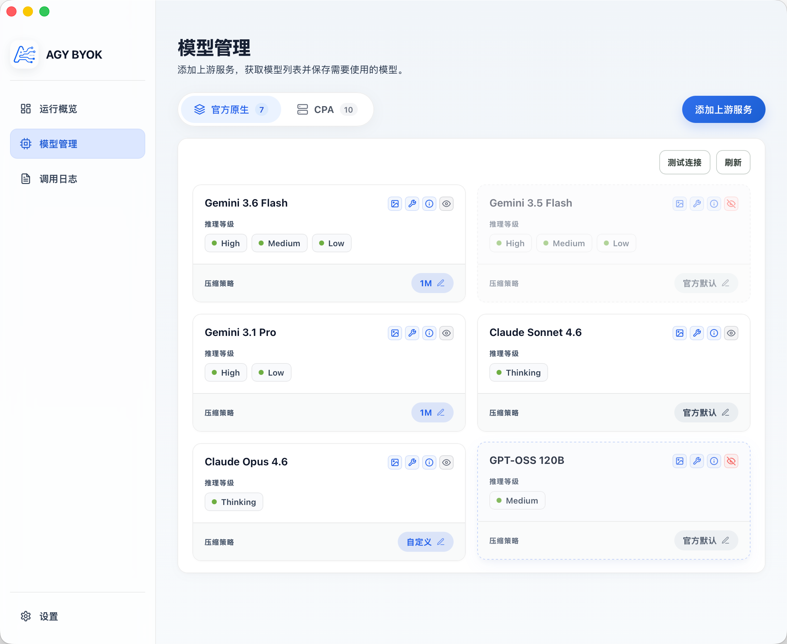
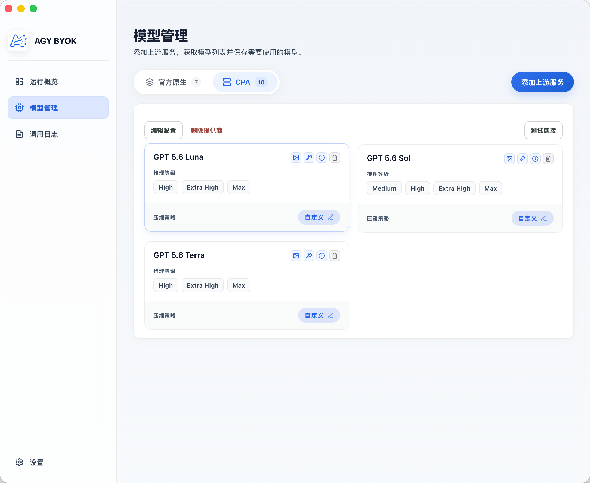
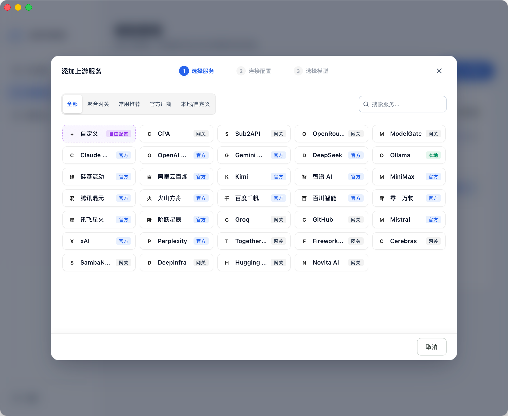
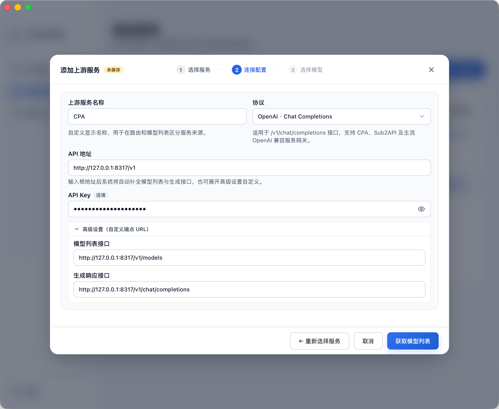
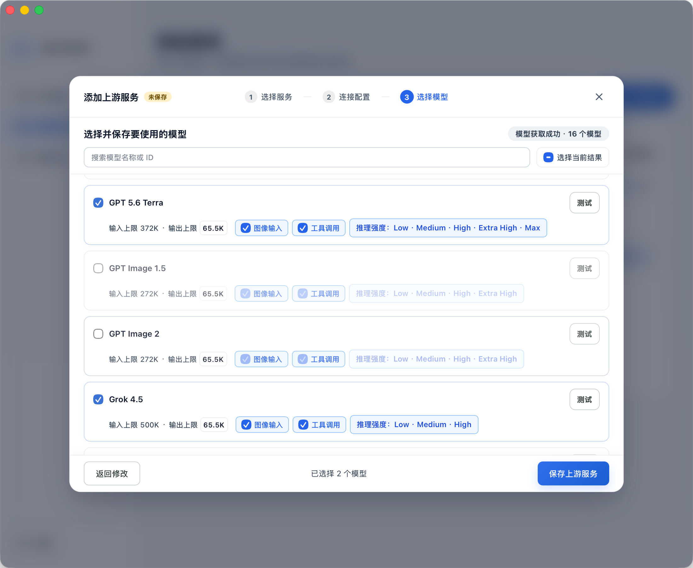
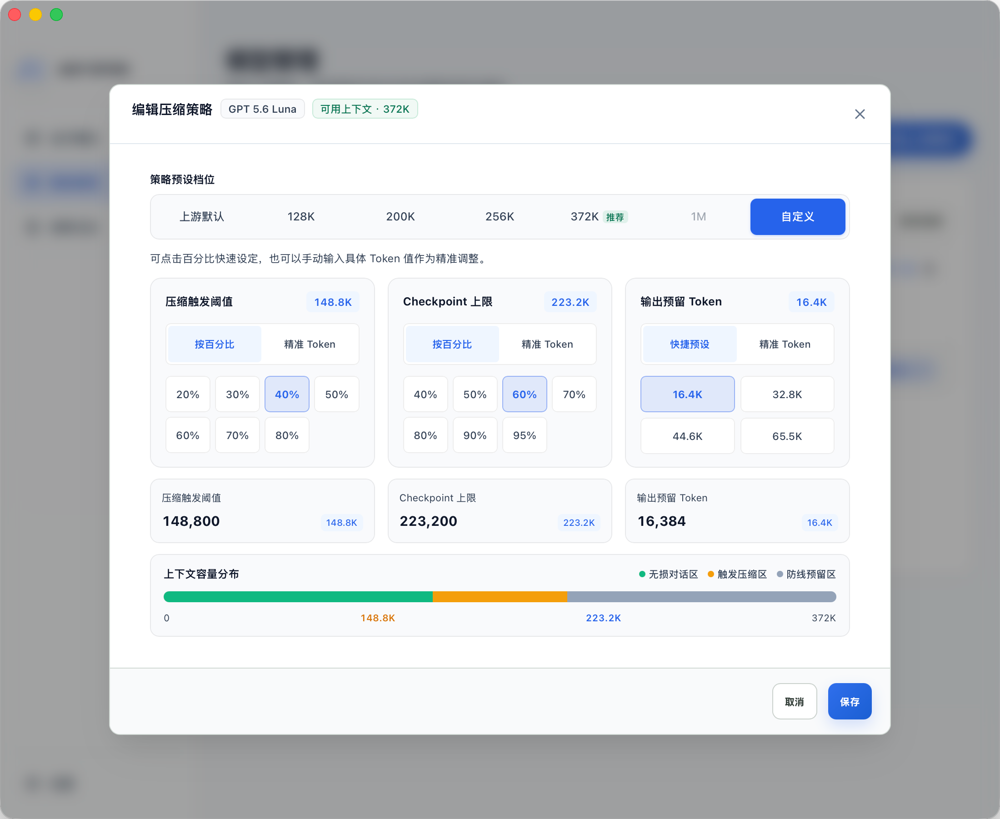

# AGY BYOK

[English](README.md) · 简体中文

[](LICENSE)
[](#当前状态)
[](#环境要求)

一款**面向 Antigravity 系列 AI 工具的本地 BYOK 模型接入工具**，支持 **Antigravity IDE**、**Antigravity App** 和 **Antigravity CLI** 通过本地代理接入其他模型服务

### 为什么做这个？

Antigravity 只提供了 Gemini 系列的模型以及较低版本的 claude 模型。 Gemini 模型的能力目前又相对较弱，pro系列的模型迟迟未面世，官方又不支持 BYOK 的功能，对于喜欢或者习惯 Antigravity 系列 AI工具的人来说就很难受。

本项目就是为了解决这个问题，如果你有其他 AI 的订阅，或者其他中转服务，可以通过 AGY BYOK 应用将你的模型注入到 Antigravity IDE,APP或者 CLI 中使用。

## ⭐ 推荐搭配：Antigravity IDE Cockpit

如果你经常使用 Antigravity IDE，建议同时安装 [**Antigravity IDE Cockpit 插件**](https://open-vsx.org/extension/yuzhiqiang/antigravity-ide-cockpit)。它是你的 Antigravity 专属账号驾驶舱，把多账号、额度和会话管理集中到一个侧边栏面板中：

- **多账号集中管理**：统一查看账号、当前激活账号、额度和 Token 用量；
- **热切号**：优先尝试不重启切换账号，减少中断；
- **自动智能切号**：按 Claude、Gemini 或当前模型的额度状态自动选择更合适的账号；
- **额度与用量监控**：实时掌握 AI 配额、Token 消耗、费用估算和模型调用趋势；
- **会话与模型诊断**：管理会话、检测模型可用性，并导出脱敏诊断报告。

简单来说：**AGY BYOK 负责把你想用的模型接入 Antigravity，Antigravity IDE Cockpit 负责让你的账号、额度和会话更好管理。** 两者配合使用，让 Antigravity 的日常使用更顺手、更可控。

👉 [立即在 Open VSX 安装 Antigravity IDE Cockpit](https://open-vsx.org/extension/yuzhiqiang/antigravity-ide-cockpit) · [访问官网 agycockpit.com](https://agycockpit.com)

---

## 交流群

欢迎加入 Antigravity 交流群，群号：`613214996`。

<p align="center">
  
</p>

### Telegram 群

[加入 Telegram 群组](https://t.me/+IMj6SaNJAAhlNjM1)

---

## 功能概览

### 1. 运行概览 (Overview)

运行概览是 AGY BYOK 的主控制台，为你提供一站式的代理和宿主状态概览：

- **代理状态**：查看本地代理是否运行以及实际监听地址
- **配置状态**：查看已配置的模型数量和当前准备状态
- **宿主状态**：检测 Antigravity IDE、App 和 CLI 是否已安装、是否运行
- **快捷操作**：一键启动或停止代理，为指定宿主启用代理模式
- **安全恢复**：每个宿主都可以单独恢复官方模式

> 

### 2. Provider 与模型管理

- **Provider 预设**：内置海量服务商预设，涵盖国际主流官方（OpenAI, Anthropic, Gemini, xAI, DeepSeek 等）、聚合网关以及本地大模型（Ollama）
- **模型列表**：根据协议从上游服务获取模型列表，选择需要提供给 Antigravity 的模型
- **官方模型管理**：可针对 Antigravity 官方内置模型进行禁用或隐藏，保持 IDE 模型选择器的清爽
- **能力配置**：为模型细粒度地配置图像输入、工具调用和 Thinking / Reasoning 能力（支持不同厂商的专属推理档位映射）
- **连接测试**：支持测试 Provider、单个模型或一组模型

> **官方原生模型管理**
> 

> **自定义服务商模型管理**
> 

#### 2.1 添加上游服务

添加上游服务仅需三步，支持选择已有 Provider 预设或手动配置自定义服务：

1. **选择服务**：内置官方厂商、常用推荐、聚合网关及本地模型预设，也支持完全自由配置。
   > 

2. **连接配置**：填写 API 地址与 Key，支持 OpenAI、Anthropic、Gemini 协议，展开高级设置可自定义端点 URL。
   > 

3. **选择模型**：获取上游模型列表，细粒度开启图像输入、工具调用及推理等级，按需保存暴露给宿主的模型。
   > 

#### 2.2 注入到 Antigravity

保存模型并为对应宿主启用代理模式后，模型会出现在 Antigravity 的模型选择器中。宿主仍然可以继续使用官方模型，自定义模型则由 AGY BYOK 路由到配置的 Provider。同时，你可以直接在界面上对不需要的官方原生模型进行禁用或启用，避免模型列表过于臃肿。

> 

#### 2.3 模型级上下文压缩

Antigravity 官方默认的上下文压缩策略通常非常**保守**（在上下文用量很低时就会早早触发压缩），导致长会话中频繁触发 Checkpointer 摘要压缩。这不仅会增加额外的交互等待延迟和 Token 开销，还容易造成早期代码细节与对话记忆的过度精简。

通过 AGY BYOK，你可以针对每个官方或自定义模型独立定制上下文压缩策略，按需降低压缩频率：

- **多档预设与精细调节**：提供从“深度压缩”到“极限保真”的多档容量预设（如 128K、200K、256K、372K、1M），支持通过快捷百分比或精确 Token 手动调整**压缩触发阈值**、**Checkpoint 上限**以及**输出预留 Token**；
- **压缩工作模型选择**：压缩任务可以跟随当前模型执行，也可以固定指定轻量快速的 Gemini Flash，在上下文一致性、速度和成本之间取得平衡；
- **原生/上游模式兼容**：选择“官方默认”或“上游默认”时，不写入模型级覆盖，保留模型原有的 Checkpointer 与上下文限制；
- **生效方式**：压缩策略与模型注入配置保存后，重启 Antigravity IDE 或 App 即可生效。

> [!TIP]
> **💡 上下文压缩参数设置建议与权衡：**
>
> - **⚠️ 阈值设置过小（触发过于频繁）**：
>   - 对话刚进行几轮或读取几个文件就会频繁触发压缩；
>   - 每次压缩都需要额外的 LLM 摘要调用，增加等待延迟并消耗额外 Token；
>   - 历史上下文被多次过度压缩摘要，容易丢失早期关键需求和代码细节。
> - **⚠️ 阈值设置过大（过于接近模型物理上限）**：
>   - 极易超出上游模型的最大上下文窗口导致请求直接报错（`Context Window Exceeded` / `400 Bad Request`）。因为除了对话历史，实际请求还包含系统提示词、工具定义 (Tools)、推理思考过程 (Thinking Tokens) 以及模型输出预留区；
>   - 每次请求携带超长上下文会导致首字延迟 (TTFT) 显著增加，且 API Token 费用大幅上升。
> - **✅ 最佳实践建议**：
>   - 根据上游模型的实际最大 Context 窗口选择匹配的预设档位，建议为模型输出和系统工具预留 **20% ~ 30%** 的安全缓冲区（例如 200K 上下文的模型，推荐设置在 148K 左右触发压缩），既能有效减少压缩频率、完整保留长上下文，又能避免溢出报错。

> 

### 3. 本地代理与宿主接入

AGY BYOK 使用一个只监听本机地址的本地代理完成协议转换和请求转发：

- 默认地址为 `http://127.0.0.1:12345`；
- 桌面端端口被占用时，会自动选择空闲的 Loopback 端口；
- 代理可以分别接入 Antigravity IDE、App 和 CLI；
- 官方原生模型继续使用官方 Cloud Code；
- AGY BYOK 生成的模型进入本地代理和对应的 Provider Adapter。

宿主接入方式按平台区分如下：

| 平台与入口 | 接入方式 | 生效方式 |
| :--- | :--- | :--- |
| macOS / Windows · Antigravity IDE | 修改用户 `settings.json` 中的 `jetski.cloudCodeUrl`，并记录可恢复的 ownership | 运行中切换时按需重启 |
| macOS · Antigravity App | 管理用户会话级 `CLOUD_CODE_URL`，不修改厂商签名包 | 运行中切换时按需重启，AGY BYOK 启动时恢复已启用状态 |
| Windows · Antigravity App | 管理用户级 `CLOUD_CODE_URL` 环境变量 | 运行中切换时按需重启 |
| macOS · Antigravity CLI | 管理用户会话级 `CLOUD_CODE_URL` | 完全退出并重新打开终端应用后生效，AGY BYOK 启动时恢复已启用状态 |
| Windows · Antigravity CLI | 管理用户级 `CLOUD_CODE_URL` 环境变量 | 完全退出并重新打开终端应用后生效 |

同一平台上的 App 与 CLI 共享一份环境变量 ownership；只有最后一个入口停用时才恢复接入前的值，避免互相覆盖。macOS 使用当前登录会话环境，Windows 使用用户级环境。通过 CLI 卡片变更共享环境时，不会停止、启动或重启正在运行的 App。

### 4. 上游协议与模型能力

当前支持以下上游协议：

| 协议 | 常见接口 | 适用场景 |
| :--- | :--- | :--- |
| OpenAI Chat Completions | `/v1/chat/completions` | OpenAI 兼容网关 |
| OpenAI Responses | `/v1/responses` | Responses API 兼容服务 |
| Anthropic Messages | `/v1/messages` | Anthropic 官方或兼容服务 |
| Gemini `generateContent` | `/v1beta/models/{model}:generateContent` | Gemini 原生 API |

支持的请求能力包括：

- 文本输入；
- 内联图片；
- 工具调用；
- 流式响应；
- 不同 Provider 的 Thinking / Reasoning 等级映射。

具体能力取决于上游服务本身。模型管理页面会记录已确认的能力，并在协议转换时完成对应映射。

### 5. 调用日志 (Activity Logs)

调用日志用于查看代理转发的 HTTP 请求和响应元数据：

- 查看请求路由、Provider、状态和耗时；
- 区分官方接口透传和自定义模型路由；
- 支持刷新、失败筛选和清空内存日志；
- 日志只保存在内存中，不记录 Prompt、回答、Tool 参数、Header 或 API Key。

> 

### 6. 应用设置 (Settings)

应用设置用于管理本地代理服务端口、配置文件和应用偏好：

- **常规偏好**：切换简体中文 / English 界面和外观主题；
- **网络代理**：查看和调整本地代理相关配置；
- **数据存储**：管理本地配置和数据位置；
- **关于应用**：查看应用信息。

> 

---

## 工作方式

```text
Antigravity IDE / App / CLI
            │
            │ 选择由 AGY BYOK 注入的 Model
            ▼
      http://127.0.0.1:12345
            │
            │ 协议转换、模型路由、请求转发
            ▼
 Provider / 公司内部网关 / 本地模型服务
```

---


## 安装指南 (Installation)

当前项目面向 macOS 和 Windows，并在 CI 中分别执行 Rust Clippy、测试和完整 Tauri 桌面构建。下面以 macOS 为主要示例；Windows 使用相同的 Tauri / npm 命令构建。

### 1. 下载对应平台的安装包

前往 [GitHub Releases](https://github.com/yuzhiqiang1993/agy-byok/releases/latest) 下载最新稳定版本：

| 平台 | 推荐安装包 |
| :--- | :--- |
| macOS Apple Silicon | `aarch64.dmg` |
| macOS Intel | `x64.dmg` |
| Windows | `x64-setup.exe` 或 `x64_en-US.msi` |

#### macOS 首次打开未签名 App

首次安装后，如果 macOS 提示应用无法打开，请先执行下面的命令，再重新打开应用：

```bash
sudo xattr -rd com.apple.quarantine "/Applications/AGY BYOK.app"
```


### 2. 从源码启动

#### 环境要求

- macOS 或 Windows；
- Rust stable 与 Cargo；
- Node.js 与 npm；
- macOS 需要 Xcode Command Line Tools，Windows 需要 Tauri 所需的 Windows 构建工具。

#### 安装依赖并启动

在项目根目录执行：

```bash
npm install
npm run tauri dev
```

启动后进入“模型管理”，添加 Provider 和模型即可开始配置。源码开发不需要执行下面的 quarantine 隔离属性命令。


---

## 常见问题排查 (Troubleshooting)

### macOS 提示应用无法打开？

在系统命令行执行下面命令后重新打开即可。

```bash
sudo xattr -rd com.apple.quarantine "/Applications/AGY BYOK.app"
```

### Windows 提示应用来自未知发布者？

先确认安装包来自你信任的构建或发布来源。Windows SmartScreen 的提示通常与应用尚未完成签名有关；不要对来源不明的应用强行绕过系统保护。

### 代理启动后，IDE 或 App 没有走自定义模型？

按以下顺序检查：

1. 在“模型管理”中确认至少保存了一个模型；
2. 在“运行概览”中确认本地代理正在运行，并记下实际监听地址；
3. 确认对应宿主卡片显示为已启用代理模式；
4. 如果 IDE 或 App 正在运行，等待其按需重启，或手动重新打开；
5. CLI 需要完全退出并重新打开终端应用；
6. 查看“调用日志”确认请求是否到达本地代理。

### Provider 连接测试失败？

检查 API 地址是否为正确的服务根地址、协议是否匹配、API Key 是否有效，以及上游服务是否要求额外的端点配置。无鉴权的本地服务可以留空 API Key。

### 恢复官方模式会删除我的配置吗？

不会。恢复操作只撤销 AGY BYOK 接管的宿主配置，不会删除 Provider、模型或本地配置，也不会自动停止本地代理。

---

## 非官方声明

AGY BYOK 是独立开发的非官方兼容工具，与 Google 或 Antigravity 官方没有隶属、授权或背书关系。项目不会分发 Antigravity 原始二进制或完整源码。

## 许可证

本项目使用 [MIT License](LICENSE)。

## 免责声明

本项目仅供个人学习和研究使用。使用本项目即表示你同意：

- 遵守相关服务的使用条款和法律法规；
- 自行承担配置和使用自定义 Provider、API Key 以及本地代理的风险；

项目作者对因使用本项目而产生的任何直接或间接损失不承担责任。
